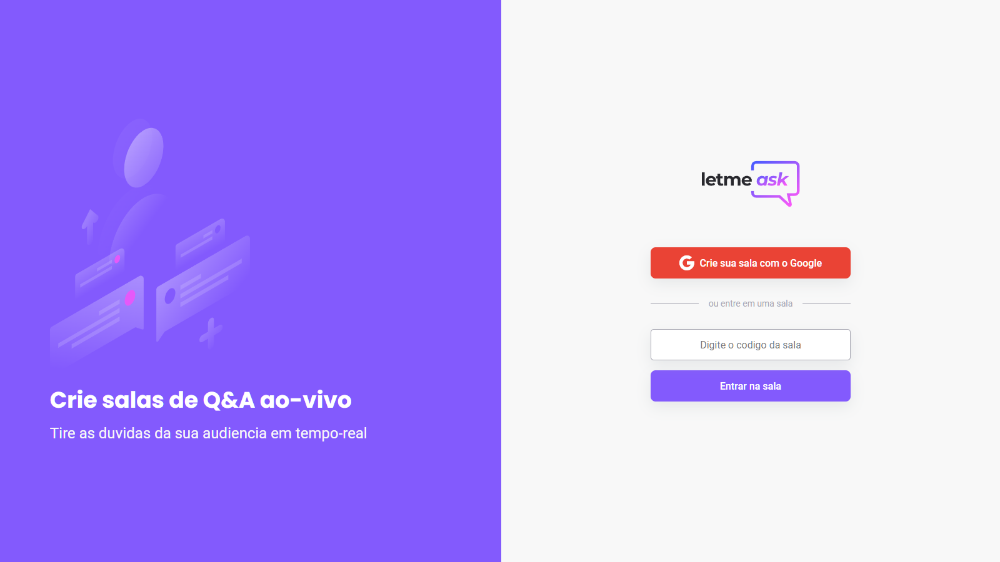
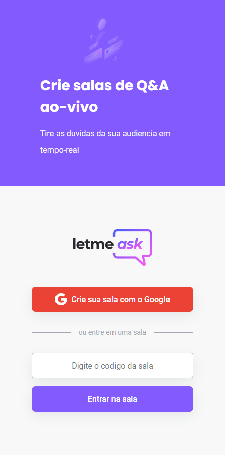

# Letmeask

Projeto criado na Next Level Week Together __NLW 06__ da Rocketseat  
Site para acessar o projeto: <https://letmeask-4c307.web.app/>

   
  

 

### 🧪 Tecnologias  
Esse projeto foi desenvolvido com as seguintes tecnologias:

* React
* Firebase
* TypeScript
* React Router
* React Modal
* React Hot Toast
 

### 🚀 Como executar
Clone o projeto e acesse a pasta do mesmo.

$ git clone https://github.com/gabrielborel/letmeask  
$ cd letmeask

Para iniciá-lo, siga os passos abaixo:

#### Instalar as dependências
$ yarn

#### Iniciar o projeto
$ yarn start  
O app estará disponível no seu browser pelo endereço http://localhost:3000.

Lembrando que será necessário criar uma conta no Firebase e um projeto para disponibilizar um Realtime Database.
 
 
### 💻 Projeto
Letmeask é perfeito para criadores de conteúdos poderem criar salas de Q&A com o seu público, de uma forma muito organizada e democrática.  
Aonde os criadores de conteúdos criam uma sala, desponibilizam o link da sala para o seu público e assim o público envia perguntas para o criador da sala.
